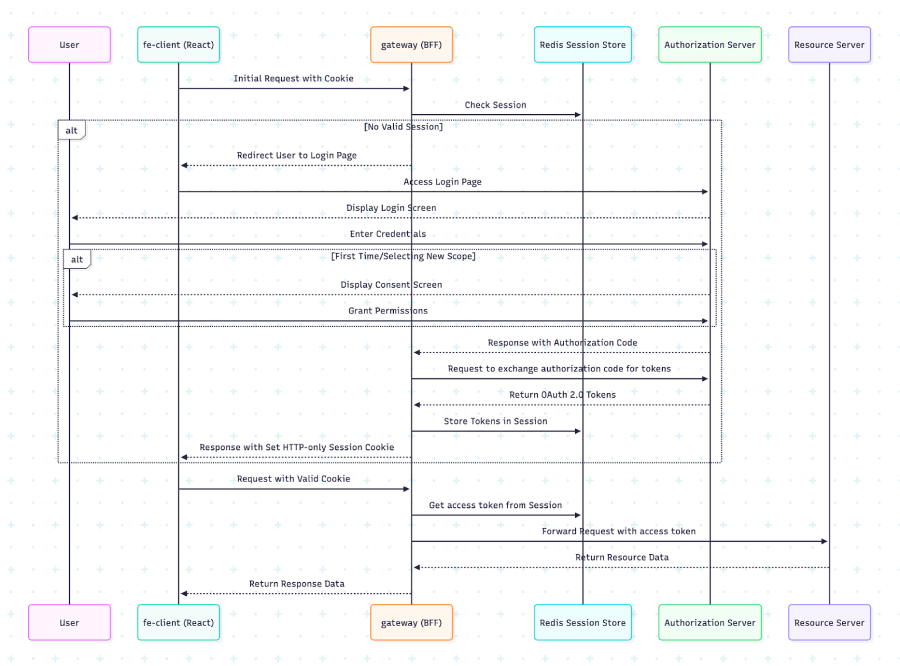

# 📚 Bookommerce

## 📋 Overview
A book e-commerce web app with separated servers handling specific responsibilities via the OAuth2 protocol.

## 🚀 Key Components

*   **Customer and Admin UI**: Build with **ReactJS** and **Ant Design** library, code is generated using Google Antigravity AI agent.
*   **API Gateway (OAuth2 confidential client)**: Build with **Spring Cloud Gateway Server Web MVC**, attach access tokens and route incoming requests to the resource server.
*   **Authorization Server**: Build with **Spring Authorization Server**, handle registration, login, access token issuance, permissions management, and Google OAuth2 login delegation.
*   **Resource Server**: Build with **Spring OAuth2 Resource Server**, handle the core business logic of the book e-commerce system.
*   **Infrastructure & Data**: Use **Spring Cloud Config Server** for centralized configuration management, **Spring Session JDBC** for persistent storage of sessions and OAuth2 flow data, and **Spring Data Redis** for caching user profiles, genres, and book details,...
*   **Security**: Secure all requests via **HTTPS** using self-signed SSL certificates.

## 🏗 Architecture Pattern
This project implements **Backend-for-Frontend (BFF)** pattern for browser-based applications.

## 🔗 References
*   [OIDC/OAuth 2.0 for Browser-Based Apps](https://www.ietf.org/archive/id/draft-ietf-oauth-browser-based-apps-15.html#name-backend-for-frontend-bff)
*   [Securing Web Apps with Spring Security OAuth 2.0 BFF Pattern](https://productdock.com/securing-your-web-apps-spring-security-oauth-2-0-bff-pattern/)
*   [Spring Cloud Gateway BFF Implementation](https://github.com/GoodbyePlanet/spring-cg-bff)
